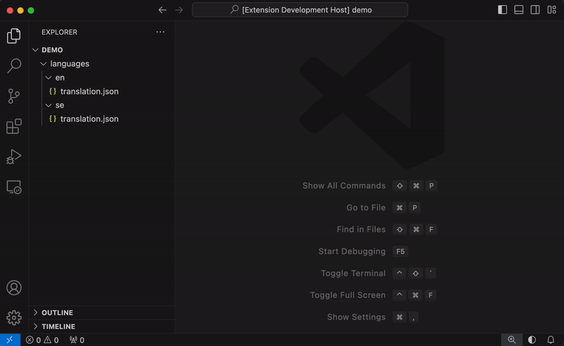
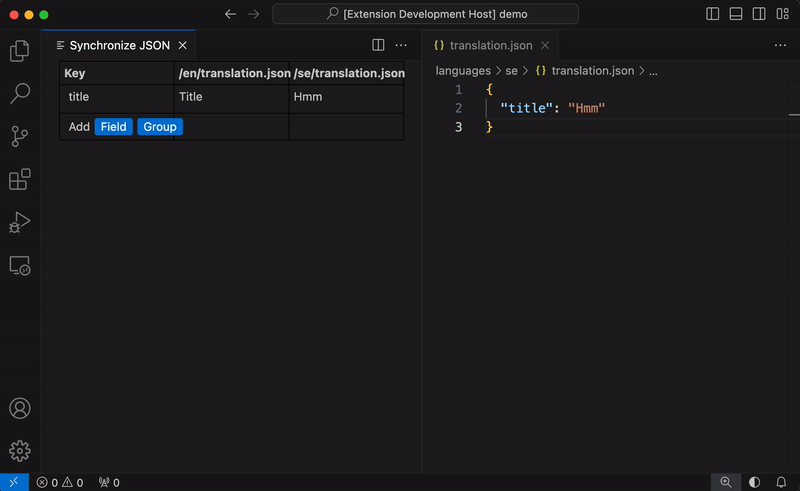
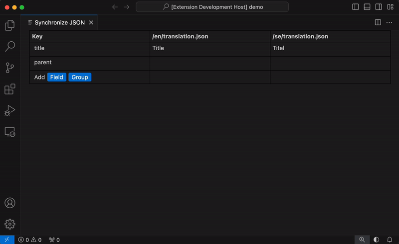

# JSON Synchronizer

## Features

JSON Synchronizer allows simultaneous editing of multiple JSON files, suitable for i18n management. Each file must contain a single object, which can include nested objects and strings.

  Right click on a folder and click "Synchronize JSON" to open all JSON files in the file structure below. 

  

  Files are edited in realtime.  
  

  Aggregates warnings of missing values in nested objects. 
  

## Known Issues

Does not support using discard changes in Git.

## Release Notes

### 1.0.0

Initial release